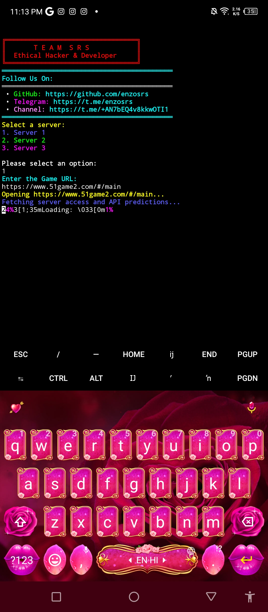

# **Predict-Srs** - Prediction Script

[](https://opensource.org/licenses/MIT)

This is an advanced **Prediction Script** that utilizes multiple servers to provide real-time predictions. Users can select one of three servers for predictions and interact with the system via a terminal-based interface. The script is compatible with **Termux**, **Linux**, and **Parrot OS** environments, and includes a user-friendly exit banner and a restart option.

The repository provides you with the full source code to easily install and run the script. Whether you're using it for fun, learning, or experimentation, this script is designed to work seamlessly across different platforms.


---

## **Features**

- **Multi-Server Support**: Choose between three servers for predictions (Server 1, Server 2, Server 3).
- **Real-Time Prediction**: The script calculates predictions based on the server you select.
- **Stylish UI**: Terminal-based user interface with colored outputs for clear and readable results.
- **Re-run Predictions**: Ask to run predictions again after each calculation.
- **Clean Exit**: Stylish exit banner with an option to exit the script or run it again.
- **Cross-Platform**: Compatible with **Termux**, **Linux**, and **Parrot OS**.
- **Easy Installation**: Simple and easy-to-follow installation steps.

---

## **How it Works**

1. **Server Selection**: The script lets you choose from three different servers, each offering a unique approach to generating predictions.

   - **Server 1**: 
     - Provides **standard predictions** based on basic algorithms.
     - Suitable for quick and straightforward predictions, often used for general use cases.
   
   - **Server 2**: 
     - Uses **advanced prediction models** for more accurate and refined results.
     - Ideal for users looking for higher precision in predictions, with more complex calculations involved.
   
   - **Server 3**: 
     - Offers **experimental and unique predictions**.
     - This server utilizes unconventional methods or cutting-edge algorithms, perfect for users interested in trying out new prediction strategies or testing the boundaries of prediction models.

2. **Prediction Generation**: 
   - Once a server is selected, the script will use the server's specific prediction method to calculate and generate predictions.
   - The result is displayed in real-time in your terminal, making it easy to view and understand.

3. **Ask to Run Again**:
   - After the prediction is displayed, the script prompts the user with the option to either **run the prediction again** or **exit**.
   - If you choose to run it again, the script restarts the process, allowing you to experiment with different servers or conditions for fresh predictions.

---
<div style="text-align: center;">
  
  
  
  
   
</div>

## **Installation Instructions**

### For **Termux** (Android)

1. **Update Termux**:
    ```bash
    pkg update && pkg upgrade
    ```

2. **Install Dependencies**:
    ```bash
    pkg install bash curl git
    ```

3. **Clone the Repository**:
    ```bash
    git clone https://github.com/enzosrs/Predict-Srs.git
      ```
4. **Change to the script directory**:
   ```bash
    cd Predict-Srs
    ```

5. **Make the Script Executable**:
    ```bash
    chmod +x bash.sh
    ```

6. **Run the Script**:
    ```bash
    bash bash.sh
    ```

---

### For **Linux** (Ubuntu/Debian)

1. **Update the System**:
    ```bash
    sudo apt update && sudo apt upgrade
    ```

2. **Install Dependencies**:
    ```bash
    sudo apt install bash curl git
    ```

3. **Clone the Repository**:
    ```bash
    git clone https://github.com/enzosrs/Predict-Srs.git
      ```
4. **Change to the script directory**:
   ```bash
    cd Predict-Srs
    ```

5. **Make the Script Executable**:
    ```bash
    chmod +x bash.sh
    ```

6. **Run the Script**:
    ```bash
    bash bash.sh
    ```

---

### For **Parrot OS**

1. **Update the System**:
    ```bash
    sudo apt update && sudo apt upgrade
    ```

2. **Install Dependencies**:
    ```bash
    sudo apt install bash curl git
    ```

3. **Clone the Repository**:
    ```bash
    git clone https://github.com/enzosrs/Predict-Srs.git
      ```
4. **Change to the script directory**:
   ```bash
    cd Predict-Srs
    ```

5. **Make the Script Executable**:
    ```bash
    chmod +x bash.sh
    ```

6. **Run the Script**:
    ```bash
    bash bash.sh
    ```

---

## **How to Use**

1. **Choose a Server**: After running the script, select one of the three available server options (1, 2, or 3).
   
2. **Enter the Game URL**: Once the server is selected, input the game URL when prompted.

3. **Prediction**: The script will process the URL and provide you with predictions based on the server’s calculation method.

4. **Ask to Run Again**: After showing the prediction result, the script will ask if you want to run the script again or exit.

5. **Exit or Re-run**: Choose whether to exit the script with a clean exit banner or run the script again.

---

## **Disclaimer**

- **Responsibility**: The developer of this script holds no responsibility for any issues or consequences arising from the use of this script. Use it responsibly.
- **Not for Critical Use**: The predictions provided are for fun and educational purposes only. They should not be relied upon for real-world decisions.
- **Security**: Always verify the source of any script before running it, especially on public systems.

---

<div style="display: flex; align-items: center;">
  <!-- Programming Languages and Technologies section -->
  <div style="flex: 1;">
    <h2>Developer Info</h2>
    <p>Hello! I'm Enzo, an experienced Web Developer, Android App Developer, and Advanced Telegram Bot Creator. I specialize in crafting intuitive applications, robust web platforms, and innovative automation solutions. My work is focused on delivering high-quality, user-friendly experiences that blend functionality with cutting-edge technology.</p>
<h3>🛠️ Programming Languages</h3>
<ul>
  <li> HTML</li>
  <li> CSS</li>
  <li> JavaScript</li>
  <li> Python</li>
  <li> React JS</li>
  <li> PHP</li>
  <li> Bash</li>
</ul>


  <!-- GIF section placed on the right side -->
  <div style="flex-shrink: 0; margin-left: 20px;">
    
  </div>
</div>


### 📞 Contact Me

<a href="https://t.me/enzosrs" target="_blank" style="text-decoration: none;">
     @enzosrs
</a><br>

<a href="https://www.instagram.com/sanam.ux?igsh=MWNtNzNsMGRsYWNsbw==" target="_blank" style="text-decoration: none;">
      @sanam.ux
</a><br>

<a href="https://github.com/enzosrs" target="_blank" style="text-decoration: none;">
     Enzo's GitHub
</a><br>

<a href="enzosrs@gmail.com" target="_blank" style="text-decoration: none;">
     enzosrs@gmail.com
</a>
